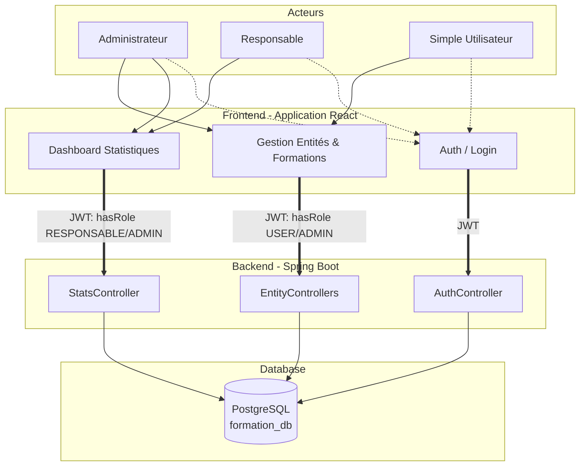

# Plan d'Implémentation & Architecture "Formation Manager"

Ce document sert de **cahier des charges technique et de plan de sprint** pour le projet "Formation Manager". Il est conçu pour être partagé afin que l'équipe (binôme/coworkers) puisse se synchroniser sur les objectifs, l'architecture et la répartition des tâches.

> [!NOTE]
> **Stack Technique :**
> - **Backend :** Spring Boot (Java 21), Spring Security (JWT), Spring Data JPA, Hibernate, PostgreSQL.
> - **Frontend :** React (TypeScript), Vite, TailwindCSS (ou similaire), React Hook Form, Axios/React Query.
> - **Infrastructure :** Docker-compose (DB, Backend, Frontend).

---

## 1. Architecture Globale et Rôles

Le système répond à la problématique de digitalisation de la gestion des formations (fini Excel et papier). Il repose sur une architecture REST sécurisée par JSON Web Tokens (JWT).

---

## 2. Dictionnaire des Données & Structure relationnelle

Afin d'utiliser au mieux Hibernate ORM, voici le comportement attendu des entités (qui se traduiront par des tables PostgreSQL).

| Entité | Champs (Type) | Contraintes & Validations | Relations |
| :--- | :--- | :--- | :--- |
| **Utilisateur** | Id (PK, AI), Login (Str), Password (Str) | `Login` unique et non vide, Mot de passe hashé (BCrypt) | `ManyToOne` vers **Role** |
| **Role** | Id (PK, AI), Nom (Str) | Valeurs: `ADMIN`, `RESPONSABLE`, `USER` | - |
| **Domaine** | Id (PK, AI), Libelle (Str) | Unique, non vide (informatique, finance...) | - |
| **Profil** | Id (PK, AI), Libelle (Str) | Unique, non vide (bac+5, juriste...) | - |
| **Structure** | Id (PK, AI), Libelle (Str) | Unique, non vide (centrale, régionale...) | - |
| **Employeur** | Id (PK, AI), Nom (Str) | Unique, non vide | - |
| **Formateur** | Id (PK, AI), Nom(Str), Prenom(Str), Email(Str), Tel(Int), Type(Enum:`INTERNE/EXTERNE`) | Email valide, Tel valide | `ManyToOne` vers **Employeur** |
| **Participant** | Id (PK, AI), Nom(Str), Prenom(Str), Email(Str), Tel(Int) | Email valide | `ManyToOne` vers **Structure** & **Profil** |
| **Formation** | Id (PK, AI), Titre(Str), Annee(Int), Duree(Int en jours), Budget(Double), Lieu(Str), DateDebut(Date) | Budget positif, Durée > 0 | `ManyToOne` vers **Domaine** & **Formateur**, `ManyToMany` vers **Participant** |

---

## 3. Stratégie de Branches & Contenu des Tâches (Git Workflow)

Afin d'éviter tout conflit de code, le travail est découpé par branche de fonctionnalité (`feature/`). **Important pour la répartition de l'équipe :** chaque développeur qui prend une branche se charge de livrer l'ensemble des éléments listés ci-dessous pour cette branche.

### 1️⃣ `feature/parametrage-de-base`
Cette branche contient les dictionnaires de données. C'est la base de départ obligatoire.
- **Backend (Spring Boot) :**
  - Entités (`@Entity`) : `Domaine.java`, `Profil.java`, `Structure.java`, `Employeur.java`
  - Repositories (`JpaRepository`) pour ces 4 entités.
  - Services et Controllers (`@RestController`) : `DomaineController`, `ProfilController`, etc. pour le CRUD de base.
- **Frontend (React) :**
  - 4 Écrans/Vues d'administration (ex: `DomainesPage.tsx`).
  - Composants de tableaux (DataTables avec actions Éditer/Supprimer).
  - Modales/Dialogues ou formulaires d'ajout/édition pour chacun de ces paramètres.

### 2️⃣ `feature/gestion-formateurs`
Dépend du paramétrage de base (Table Employeur).
- **Backend :**
  - Entité `Formateur.java` avec `@ManyToOne` vers `Employeur`.
  - Contrôles de validation (`@Email`, `@NotBlank`) dans un DTO `FormateurRequest`.
  - `FormateurController` et son service associé.
- **Frontend :**
  - Vue `FormateursPage.tsx` affichant la liste des formateurs internes et externes.
  - Formulaire de création `FormateurForm.tsx` avec logique conditionnelle : l'input de sélection de l'employeur (chargé depuis l'API) n'apparaît ou n'est obligatoire que si le `Type` est "externe".

### 3️⃣ `feature/gestion-participants`
Dépend du paramétrage de base (Tables Structure et Profil).
- **Backend :**
  - Entité `Participant.java` avec double `@ManyToOne` vers `Structure` et `Profil`.
  - `ParticipantController` avec capacité de recherche multi-critères (ex: `findByStructureAndProfil`).
- **Frontend :**
  - Vue `ParticipantsPage.tsx`.
  - Formulaire `ParticipantForm.tsx` contenant deux listes déroulantes (Structure et Profil) alimentées par des appels API GET lancés au montage du composant (`useEffect`).

### 4️⃣ `feature/gestion-formations` (Le Cœur du Projet)
Dépend virtuellement de toutes les autres branches.
- **Backend :**
  - Entité `Formation.java`.
  - Liaison `@ManyToOne` avec `Domaine` et `Formateur`.
  - Table de jointure et relation `@ManyToMany` avec `Participant`.
  - Gestion stricte de la création (Vérifier que les participants existent avant l'insertion en base).
- **Frontend :**
  - Écran complet `DashboardFormations.tsx` (ou planning).
  - Un formulaire très riche `FormationForm.tsx` (multi-étapes recommandé) permettant de définir le budget, d'assigner l'id du domaine, l'id du formateur (recherche asynchrone), et des checkboxes/multi-select pour assigner les participants.

### 5️⃣ `feature/tableau-de-bord` (Visualisation)
Branche plutôt orientée intégration Frontend & optimisation de requêtes SQL.
- **Backend :**
  - Création de `StatsController.java` et `StatsService.java`.
  - Création de méthodes personnalisées dans les Repositories (`@Query("SELECT ... GROUP BY...")` pour contourner la lourdeur d'envoyer toute la base au frontend).
  - Objets `StatsDashboardDTO` renvoyant les métriques clés.
- **Frontend :**
  - Intégration de la librairie **Recharts** ou **Chart.js**.
  - Vue `ResponsableDashboard.tsx` affichant des graphes et camemberts basés sur les retours de l'API.

### 6️⃣ `feature/gestion-utilisateurs` (Sécurité & Administration)
L'authentification est initialisée, il faut finaliser les interfaces super-admin.
- **Backend :**
  - Perfectionnement de `Utilisateur.java` et `Role.java`.
  - Protection fine des endpoints en ajoutant `@PreAuthorize("hasRole('ADMIN')")`.
- **Frontend :**
  - Vue `UtilisateursPage.tsx` réservée exclusivement à l'Admin.
  - Formulaire d'ajout : Nom de compte, génération du mot de passe et sélection du Rôle.

> [!TIP]
> **Plan de Bataille :** 
> Pendant que Développeur A gère la branche **`parametrage-de-base`** (très backend), Développeur B peut préparer les maquettes et composants génériques frontend (Boutons, Modales, Tables) et la configuration globale Axios (`feature/setup-front`), pour qu'ensuite vous puissiez attaquer en parallèle Formateurs et Participants !

---

## 4. Spécifications Détaillées des Endpoints Back-End

*Note : Tous les endpoints nécessitent un appel avec header `Authorization: Bearer <token>`.*

### A. Paramétrages de Base (`/api/domaines`, `/api/profils`, etc.)
- `GET /` : Récupère la liste intégrale (Rôle : `ADMIN`, `RESPONSABLE`, `USER`).
- `POST /` : Crée une nouvelle entrée. Validations `@Valid` (Rôle : `ADMIN`).
- `PUT /{id}` & `DELETE /{id}` : Modifie/Supprime. Contrôle des Foreign Keys (ex: interdire la suppression d'un domaine s'il est utilisé dans une formation).

### B. Moteur Principal : Formations (`/api/formations`)
- `POST /api/formations` :
  - **Payload DTO attendu :** `{ titre, annee, duree, budget, domaineId, formateurId, participantIds: [1, 5, 8], lieu, date }`.
  - **Logique métier :** Le Service Spring vérifiera l'existence de chaque ID avant de mapper et de sauvegarder la relation ManyToMany dans la table de jointure.
- `GET /api/formations/year/{annee}` : Pour faciliter le système d'archives annuel demandé par le client.

### C. Statistiques & Reporting (`/api/stats`)
Endspoints réservés à l'Administrateur et Responsable. Requêtes JPA optimisées :
- `GET /api/stats/budget-par-domaine`
- `GET /api/stats/participants-par-structure`
- `GET /api/stats/overview` (Retourne : nombre total formations cette année, budget consommé, nombre de formateurs actifs).

---

## 5. Spécifications Front-End (React App)

> [!WARNING]
> La fiabilité des données étant exigée, le frontend doit bloquer les saisies erronées **AVANT** l'appel réseau via **React Hook Form & Zod/Yup**.

### Composants Clés recommandés :
- **Authentification :** Gérée via un Hook global `useAuth()` et un contexte pour maintenir le token JWT rafraîchi via Axios Interceptors.
- **Formulaire Formation (`FormationForm.tsx`) :** 
  - Doit être multi-étapes ou utiliser des `Select` enrichis (type Combobox) vu la potentielle quantité de données.
  - Sélection du Formateur (filtrage par interne/externe dynamique).
  - Sélection multiple de Participants avec "Puces/Chip" pour voir clairement les personnes assignées.
- **Tableau de Bord (`Dashboard.tsx`) :**
  - Utilisation de `Recharts`.
  - Affichage visuel (Camemberts pour la répartition budgétaire, Histogrammes pour l'évolution des formations sur l'année).

### Sécurisation des Routes React :
- Création d'un wrapper `<ProtectedRoute allowedRoles={['ADMIN', 'USER']}> ... </ProtectedRoute>` pour bloquer instantanément l'affichage des écrans aux utilisateurs non autorisés.

---

## 6. Prochaines Étapes Communes

1. S'aligner sur qui développe quelle feature (cf Section 3).
2. Valider le modèle de la Base de données (Spring Boot `application.properties` en ddl-auto=`update` pendant le dev).
3. Effectuer des `git pull` réguliers de la branche `main` avant de fusionner les branches de feature.
